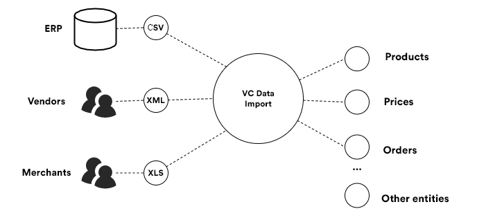
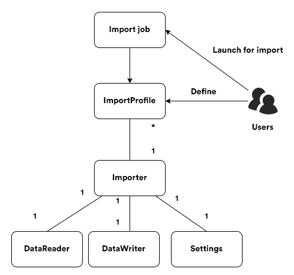

# Import Framework Main Concept

This article explains the architecture and behavior of Virto Commerce Import Framework, which allows you to easily import your data, such as product information, customers, categories, and much more, into the Virto Commerce platform.

## Overview

_VC Data Import_ allows you to define what kind of data you want to import into your application using custom configurable _Import profiles_ where one determines what types of data to import and from which data sources.



When using VC Data Import, you can leverage its key advantages:

-   Manage user defined import profiles directly from the platform manager UI
    
-   See the import history with detailed logs
    
-   Work with an extensibility model that enables extending the existing built-in importers with new data types and sources

## Core Structure
The chart below shows VC Data Import's high level logical structure:



As you can clearly see, VC Data Import is based on three main objects:

-   _Import job_: An object for a task that imports data according to _ImportProfile_; you can run it both manually on-demand or regularly based on a schedule.

-   _Import profile_: A user-defined entity with a unique name acting as its ID. Each profile must be associated with a certain _Importer_ and also can be configured through the runtime parameters in _Settings_ that _Importer_ might provide.
    
-   _Importer_: A piece of code that reads data from a specific data source file (CSV, XLS, etc.) and writes an object of a specific data type (products, prices, etc.) to the target system. Each _Importer_ consists of the three main objects:
    
    -   _DataReader_, which reads data from a file (CSV, XSLS, YML, etc.) or another type of external source (a database, a web service, etc.);
        
    -   _DataWriter_ that writes the imported objects into the system; and
        
    -   _Settings_, which provides settings that can be used to configure _ImportProfile_ linked to the importer in question.
        

## Additional development information.

To create a Custom Importer, the developer needs to define their own DataReader and DataWriter, and define Settings and Validation rules, if necessary. Currently, as a help, the Module provides the ability to use the CSV Reader as part of the [VirtoCommerce.ImportModule.CsvHelper](https://www.nuget.org/packages/VirtoCommerce.ImportModule.CsvHelper) package, but does not restrict the developer from writing their own Readers for any data sources.

> ***Note:*** *As an example, the process of implementing a Custom Importer using CsvHelper is detailed [here](02-building-custom-importer.md).*


The following Module services are also available for developers, which can be used in the UI:

-   `IImportRunService` is the main service for managing the execution of the import process. The service provides access to methods for previewing (_PreviewAsync_), launching an import (_RunImportAsync_), and creating a similar import task in the form of a BackgroundJob (_RunImportBackgroundJob_).

-   Services `IImportProfilesSearchService` and `IImportRunHistorySearchService` - provide search capabilities for _ImportProfiles_ and _ImportRunHistory_, respectively.

-   Services `IImportProfileCrudService` and `IImportRunHistoryCrudService` - provide facilities for CRUD operations on _ImportProfiles_ and _ImportRunHistory_.

For developers, the possibility of extending authorization for newly created Importers is available. The `DataImporterBuilder` has _WithAuthorizationReqirement_ and _WithAuthorizationPermission_ methods to set custom permissions if necessary.

## Module folder structure

```text
├─ docs                                      // module documentation
├─ samples                                   // helpful to start develop your own Importers
├─ src                                       // the main codebase of project
│  ├─ VirtoCommerce.ImportModule.Core        // core models and definitions
│  ├─ VirtoCommerce.ImportModule.CsvHelper   // import realisation for CSV format. Can be used like sample in development
│  ├─ VirtoCommerce.ImportModule.Data        // main services and models to work with data
│  ├─ VirtoCommerce.ImportModule.Data.***    // data proveder-oriented adapters (supports MySql, PostgreSql and SqlServer)
│  ├─ VirtoCommerce.ImportModule.Web         // controllers and frontend part of project
│  │  ├─import-app                           // source code of Import App
│  │  ├─...
├─ tests                                     // unit and functional tests
```

## Import App

Import App is the new user interface, based on [Virto Custom App Development](https://docs.virtocommerce.org/new/dev_docs/custom-apps-development/overview/).

Key Features:

1. Expandable with [VC Shell](https://github.com/VirtoCommerce/vc-shell) 
1. Import-on-demand for Operator user

## Import App folder structure

```text
├─ public                                    // static assets, images, etc
├─ src
│  ├─ api_client                             // generated API clients folder
│  ├─ composables                            // application composables
│  ├─ locales                                // locale files used to provide translated content
│  ├─ modules                                // the collection of custom modules
│  │  ├─ ...                                 // module folder
│  │     ├─ components                       // components specific for this module
│  │     ├─ composables                      // shared logic written using Composable API pattern.
│  │     ├─ locales                          // locale files used to provide translated content specific for this module
│  │     ├─ pages                            // set of module pages used within Application router
│  │     └─ index.ts                         // module entry point
│  ├─ pages                                  // set of application pages used within Application router.
│  ├─ router                                 // SPA routing configuration
│  ├─ styles                                 // extras application style files
│  └─ types                                  // typescript .d.ts files
```

## Getting started Import App

```bash
# install and configure package dependencies and git hooks
$ yarn

# build application
$ yarn build

# start application with hot reload at localhost:8080
$ yarn serve
```

###  Import App Version bumping

```bash
$ yarn bump patch/minor/major
```

