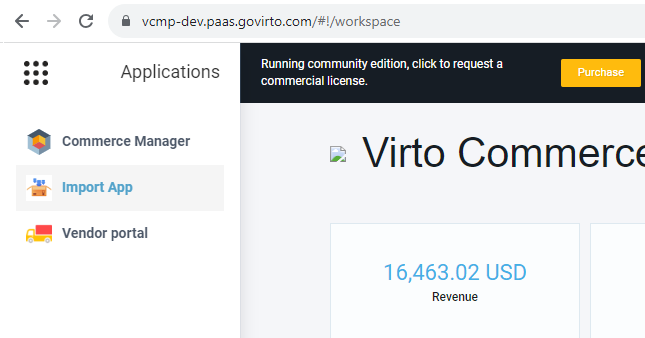
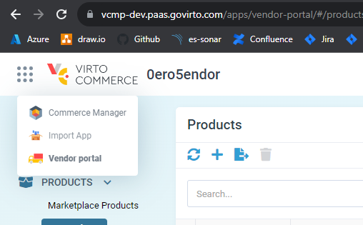

# Import Module introduction

## Installation and start

Import Module is a Virto Commerce plug-in module and its installation is no different from installing other modules:
1. Open **More** -> **Modules** -> **Available**
1. Select **Import module** in list and press _Install_. If your already installed this module, you can find it in _Installed_ section

After installing the module, the Import App will appear in the user's work environment.

## Access permissions and user interface

Import App does not provide the authorization tools to user, as it is an embedded Virto App. Authorization is inherited from the user's work environment.

To access the Import App, the user must be authorized with permission _import:access_; to create and edit import profiles permissions are: _import:create_, _import:update_ and _import:delete_; to access the import history - _import:read_; to start importing from external sources - _import:execute_.

> ***Note:*** _If the Import App was launched from the VC Marketplace environment, then the work profiles and import history of the vendor to which this user belongs will be available_

> ***Note:*** _If the Import App was launched from the VC Platform environment, then the user will have access to work profiles and import history for the groups to which he is a member with the Vendor Admin role. If necessary, the developer has the opportunity to grant the administrator access to the Import App group of another user_

