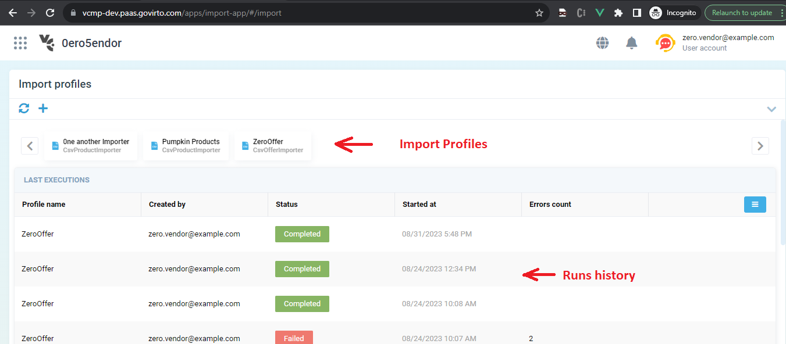
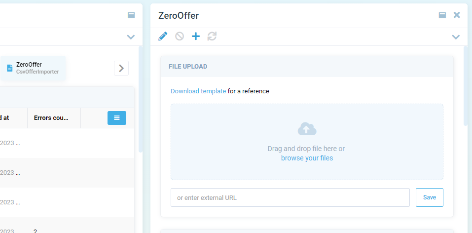
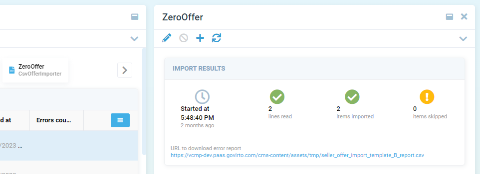

# Import App

Import App is an application built into the work environment that provides users with access to the main functionality of the Import Module.

## Key capabilities

1. Creating and editing Import Profiles. Flexible settings depending on the data source format
1. Possibility of using files on the local workplace as data sources, or downloading by URL
1. Starting an import job. During execution, the user receives detailed information about the process with the ability to interrupt the job
1. Re-run the import job without changing parameters if something goes wrong
1. Ability to view import history for each Profile
1. Downloading a template for the import file (if provided by the Importer developer, how to develop your own Importers is described [here](02-building-custom-importer.md))
1. View statistics on the completed import (count of records in the source, count of imported records, errors)
1. View detailed information about errors that occurred. Downloading a file with a list of errors for each record if huge data sources are used (if the Importer developer provides such a feature)

## Access permissions

After installing the Import Module, the user has the option to switch to the Import App from the Applications menu.

Import App does not provide the authorization tools to user, as it is an embedded Virto App. Authorization is inherited from the user's work environment.

To access the Import App, the user must be authorized with permission _import:access_; to create and edit import profiles permissions are: _import:create_, _import:update_ and _import:delete_; to access the import history - _import:read_; to start importing from external sources - _import:execute_.

> ***Note:*** _If the Import App was launched from the VC Marketplace environment, then the work profiles and import history of the vendor to which this user belongs will be available_

> ***Note:*** _If the Import App was launched from the VC Platform environment, then the user will have access to work profiles and import history for the groups to which he is a member with the Vendor Admin role. If necessary, the developer has the opportunity to grant the administrator access to the Import App group of another user_

## User interface and work scenarios

When starting the Import App, the following tools are available to the user:

1. List of Profiles that can be used for import. If necessary, the user can create a new Profile based on the Importers available in application. When selecting an element from the list, the user has the opportunity to start importing with the selected Profile.
1. Import run history - displays a list of import operations. When selecting an element from the list, the user receives detailed information about this launch.

When user select Profile from the list, opens a blade with the ability to select a data source for import (it is possible to use the file on a local workstation, or access via URL). After selecting a data source, user can run the import job. Statistics and information on task completion will be displayed on the blade or as Notifications in the application.

When user select an element from the run history, opens a blade with detailed information about imported data.

## How to extend

Import App is based on VC Shell and can be extended as usual custom app. Detailed information about VC Shell extensibility [here](https://docs.virtocommerce.org/new/dev_docs/custom-apps-development/vc-shell/Extensibility/overview/)
